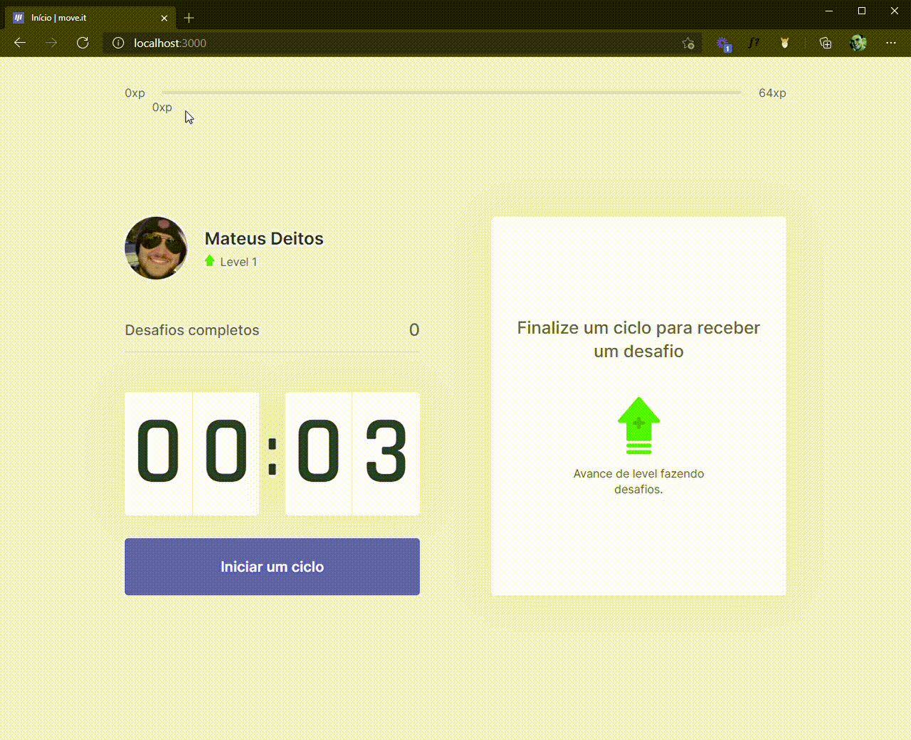

# NLW - Move.it
React App developed during NLW-4, an event promoted by Rocketseat to developers interested in learning about React, NextJs, NodeJs and Elixir.
🔗 https://nlw-moveit-jade.vercel.app/

## ✔ What was used to develop this app
* React Context Api
* React hooks
* Next.js

## 👀 Demonstration

